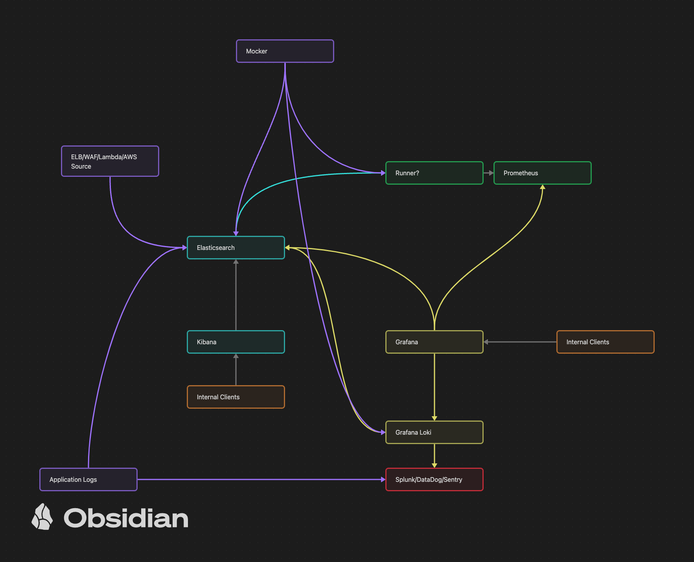

# Site Reliability Engineering (SRE) - DevOps

The purpose of this repository is to provide a guide to the tools and practices that are used in the field of Site Reliability Engineering (SRE).
We will be using Terraform, Docker, Prometheus, Grafana, and other tools to build a reliable system.

## Getting Started

To get started, you will need to install the following tools:

- [Docker](https://www.docker.com/)
- [Docker-Compose](https://docs.docker.com/compose/)

You will need a localstack account and get the access key.
You will need an axiom account.

You will need to create a `.env` file in the root of the project with the following contents:
```.env
LOCALSTACK_AUTH_TOKEN=<localstack_auth_token>
```

before you run the docker-compose command, you will need to export the environment variables in the `.env` file by running the following command:

```bash
export $(grep -v '^#' .env | xargs)
```

Running the Docker Compose:

```bash
docker-compose up
```


## Diagram 




